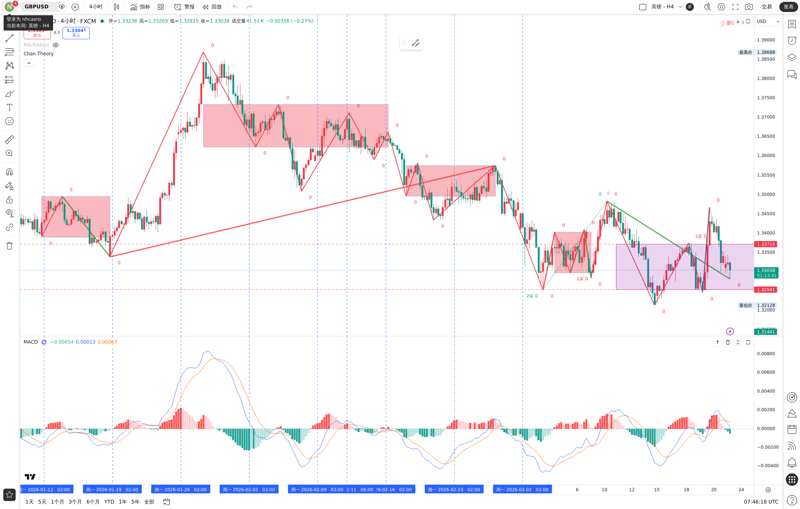
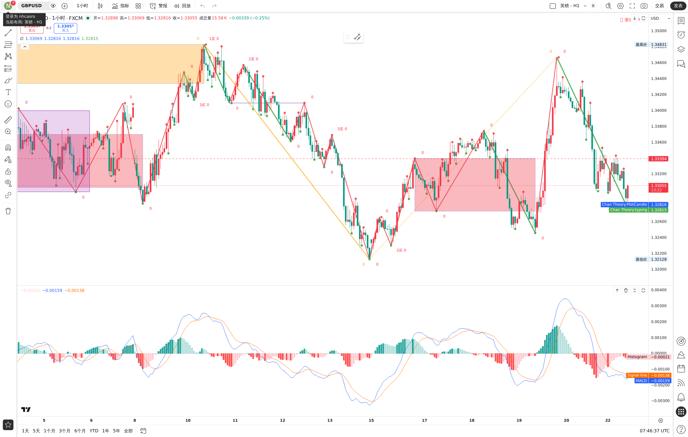
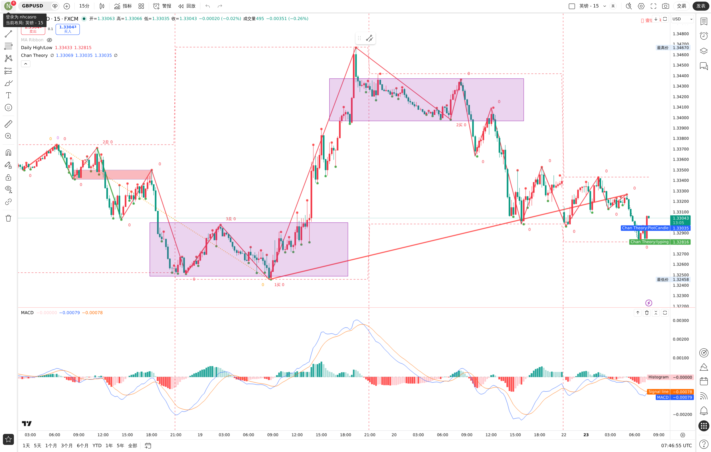

# 2026-03-23 交易分析日志

> 今日无交易，仅分析。

---

## 第一次分析 15:56 — ❌ 分析错误（已作废）

**错误原因**：未读 TRADINGVIEW.md 和 chan-definitions.md，直接看图临时发挥，价格位置读错，分析结论完全不可用。

**教训**：分析前必须先读 TRADINGVIEW.md，按协议流程执行，不得临时发挥。

---

## 第二次分析 16:42 — 正确分析

### 图表

> 注：图片为 15:56 截图，16:42 重新分析使用相同图表。后续另有 16:42 新截图（见下）。

### 分析结论

**当前价格：1.32128**

**防狼术**：4H MACD DIF 在 0 轴下方 → 只做空

**4H 级别**
- 明显下跌趋势，从高点 1.34151 一路下跌
- 最右侧中枢约在 1.33200-1.34000 区间（估算，未提供ZD/ZG）
- 当前价格已跌破该中枢下沿，向下离开中枢
- 结论：看空

**1H 级别**
- 最近中枢约在 1.33000-1.33600 区间（估算）
- 当前价格低于中枢，向下离开
- MACD DIF = -0.00157，绿柱放大，空头动能

**15M 级别**
- 小中枢约在 1.32800-1.33300 区间（估算）
- 当前价格 1.32128，低于中枢下沿
- 绿柱较大，空头力量强

**三级别共振**：三级均看空，但中枢ZD/ZG均为估算，未提供精确数值。

**操作结论**：今日观望（用户未提供ZD/ZG精确数值，无法严格判断买卖点；中枢为估算）

---

## 第三次分析 16:43 — 重新截图确认

### 图表

**当前价格：1.32128**（与第二次一致）

结论与第二次分析相同，三级别共振看空，但因缺乏ZD/ZG精确数值，当日未入场。

---

## 第四次补记（2026-03-24 回补）— 实际已入场

> 用户于 2026-03-24 补充说明：虽然昨日分析错误，但仍然按自己的判断入场了。

### 用户补充的实际交易情况

- 实际方向：**多单**
- 入场价：**1.33311**
- 止损：已设，但暂未提供具体价位
- 止盈：**未设置**
- 说明：当时机器人分析方向有误，用户未按分析建议执行

### 结果更新

- 今日补充结果截图显示：价格后续最高上行至 **1.34790** 附近
- 对应交易记录文件已创建：`../trades/2026-03-23-0000-long.md`
- 结果截图已保存：`../images/2026-03-24/gbpusd_trade_result_1.jpg`
- 当前仍缺：最终出场价、最终盈亏金额 / 点数、实际出场时间

## 今日总结

- 2026-03-23 并非“无交易”，而是**有实际入场，但当日未及时记录**
- 主要工作：修复分析流程，确认必须先读 TRADINGVIEW.md + chan-definitions.md
- 重要教训：不读协议直接分析 → 价格位置看错、数字混乱、逻辑自相矛盾
- 已完善：TRADINGVIEW.md 拆分、审计触发词、audit-checklist.md 独立文件
