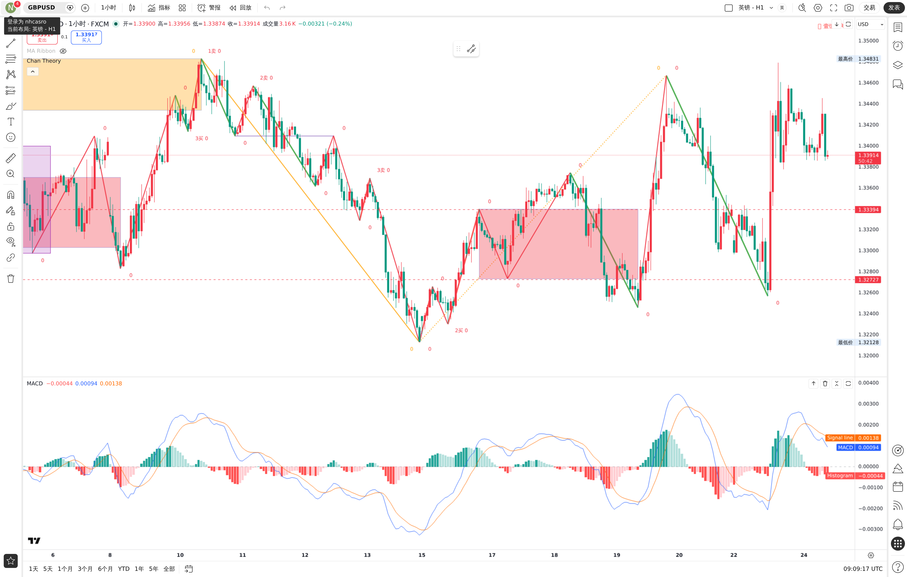
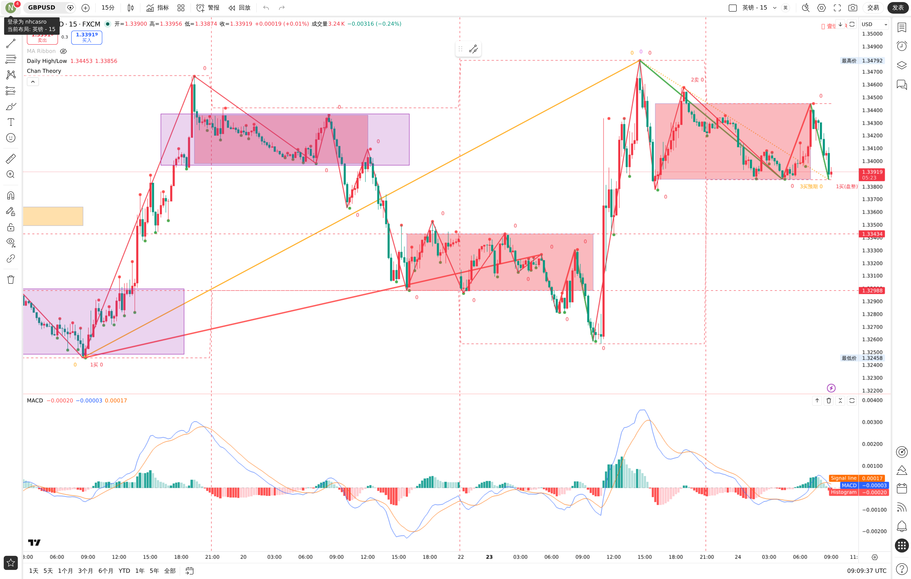
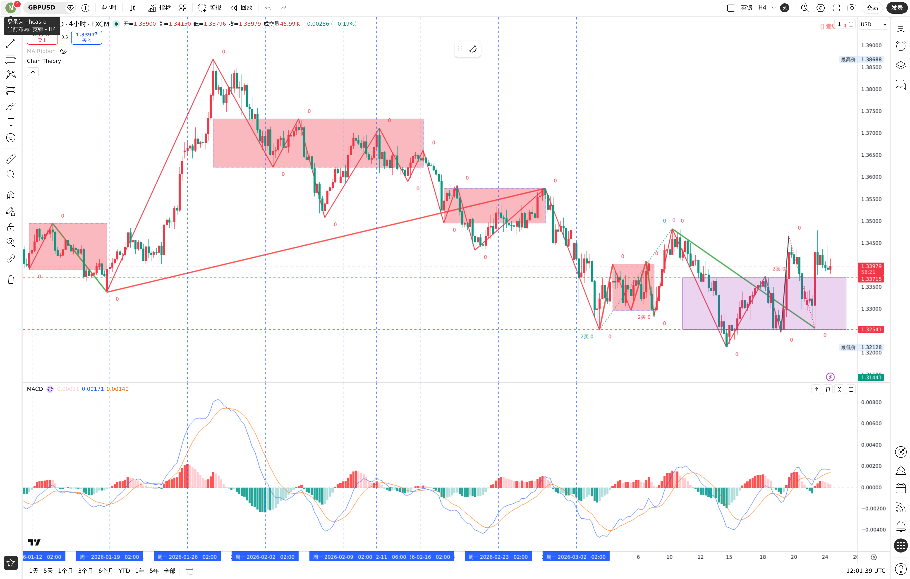
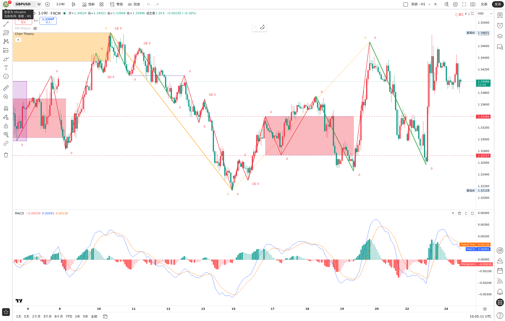
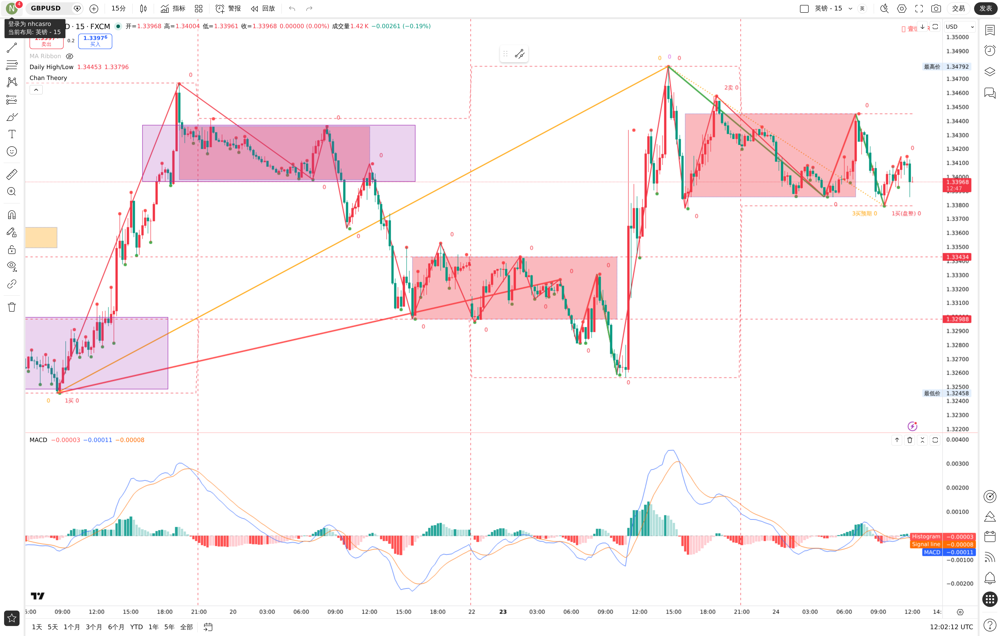

# 2026-03-24 交易分析日志

## 第一次分析 17:10 — 结构重做与审计修正

## 原始分析正文（按飞书实际回复原文入档，按新排版重组）

🧠 模型：Claude Opus 4.6

⚠️ 本次仍未提供各级别中枢 **ZD / ZG 精确数值**，以下中枢均为**截图估算**，误差约 ±10–20 点。  
⚠️ 以下严格不引用指标上的 1买/2买/3卖 标签，只按图形结构推导。  
⚠️ 背驰部分仅能做**视觉判断**，没有 MACD 数值，不做数值确认。

---

## 【交易过滤器】

**防狼术**：4H MACD DIF 在 **0轴上方**，当前只考虑 **多方向**。  
所以哪怕 15M 短线偏空，也只能理解为 **上级别多头中的回踩**，不能直接做空。

---

## 4H 图

## 4H 分析

### 1）分型
从图上可见，4H 级别最近一轮明显结构是：

- 一段下跌到 **1.321x 附近低点**
- 随后形成反弹高点到 **1.348x–1.350x 附近**
- 当前从该高点回落，但尚未跌破这轮反弹起点

这说明最近 4H 至少已经形成：
- 一个底分型区域（1.321x）
- 一个顶分型区域（1.348x–1.350x）

### 2）笔
按图上肉眼可见结构，可把最近主干笔粗分为：

- **下降笔**：前高区 → 1.321x
- **上升笔**：1.321x → 1.348x/1.350x
- **当前下降笔**：1.348x/1.350x → 现价 1.339x 附近

### 3）线段
目前 4H 不能高置信度确认“这轮上升线段已经结束”，原因是：
- 当前回落尚未破坏前面上升段的关键低点
- 只看到一段回撤，不足以证明 4H 重新进入明确下跌趋势

所以这里更合理的判法是：
- **4H 上升段之后进入整理**
- 不是“4H 已翻空”

### 4）中枢
从右侧这几段 4H 波动的重叠区肉眼估算：

- 第一段次级别走势：从 1.321x 上升到 1.34x 上方
- 第二段次级别走势：从高位回撤到 1.33x
- 第三段次级别走势：再上冲到 1.348x/1.350x

三段存在明显重叠，故可估一个 4H 中枢：

- **ZD ≈ 1.3300**
- **ZG ≈ 1.3480**

> 说明：这是截图估算，不是指标精确读取值

### 5）走势类型
- 目前更像 **4H 反弹后的中枢震荡**
- 还不足以定义成新的独立上涨趋势
- 也不足以判定为重新进入 4H 下跌趋势延续

### 6）背驰判断
- 只看截图，MACD 红柱缩短，说明上冲动能减弱
- 但要判 4H 背驰，必须明确比较哪两段、围绕哪个中枢
- 当前截图下，我只能说：
  - **上攻力度减弱**
  - **不能严格确认 4H 顶背驰成立**

### 7）4H 结论
- 方向：**偏多整理**
- 4H 只允许找多，不允许找空
- 当前不属于强追多位置，而属于“回踩后的二次确认区”

---

## 1H 图

## 1H 分析

### 1）分型
1H 图上最近最清楚的结构是：

- 一段上升，从 **1.321x** 一路涨到 **1.348x**
- 当前从 **1.348x** 回落到 **1.339x**

所以 1H 当前明显存在：
- 一个阶段底分型区域：1.321x
- 一个阶段顶分型区域：1.348x

### 2）笔
按图上结构可粗分为：

- 上升笔：1.321x → 1.333x
- 回撤笔：1.333x → 1.328x 左右
- 再上升笔：1.328x → 1.348x
- 当前下降笔：1.348x → 1.339x

### 3）线段
1H 当前最合理理解是：

- 前面一段完整上升线段已经走出
- 现在处于该上升线段后的**回踩段**

这里不能直接说 1H 转空，原因：
- 还没有看到有效跌破 1H 关键中枢下沿
- 当前更像回踩确认，而不是反转确认

### 4）中枢
从中间最明显三段重叠区估算，1H 主要中枢可取：

- **ZD ≈ 1.3280**
- **ZG ≈ 1.3380**

推导逻辑：
- 第一段上冲后回落，低点在 1.328x 附近
- 第二段再次上冲
- 第三段当前回踩回到 1.339x 附近
- 三段重叠区主要集中在 **1.3280–1.3380**

### 5）当前价格 vs 中枢
- 当前价格约 **1.339x**
- 位置上处于 **中枢上沿附近 / 略高于中枢上沿**
- 这很关键：
  - **站稳上沿** → 偏强
  - **重新跌回中枢内部** → 回踩加深
  - **跌破 ZD** → 结构转弱明显

### 6）三买 / 三卖区域判断
这里我不能直接判“三买已成立”，因为严格按定义，必须回答：

- 哪个中枢？→ 1H 估算中枢 1.3280–1.3380
- 哪段离开中枢？→ 从中枢上沿向上离开到 1.348x
- 哪段回踩？→ 当前从 1.348x 回踩到 1.339x
- 是否第一次回踩且不回中枢？→ **现在还不能确认**

原因：
- 当前价格非常接近中枢上沿
- 还没拉开足够空间
- 截图精度下无法高置信度证明“明确不回中枢”

所以结论应是：

- **1H 正处于三买候选区**
- **但三买未确认**

### 7）背驰判断
- 这里只能说：上涨后回落，MACD转弱
- 不能严格定义为 1H 顶背驰
- 因为没有明确给出围绕哪个中枢、比较哪两段上攻力度

### 8）1H 结论
- 结构：**上涨后的回踩确认**
- 当前属于 **偏强观察区**
- 关键位：**1.3380**

---

## 15M 图

## 15M 分析

### 1）分型
15M 图上最近很清楚：

- 从 **1.348x/1.349x** 高点形成下跌
- 下跌到 **1.339x** 一带后开始靠近短线支撑

可见：
- 顶分型区域明确（1.348x 上方）
- 底分型是否已经成立：**未确认**

### 2）笔
15M 当前主笔可粗分为：

- 上升笔：低位 → 1.348x/1.349x
- 当前下降笔：1.348x/1.349x → 1.339x

若要做多，至少要看到：
- 当前下降笔结束
- 新的向上笔出现
- 才能谈入场

### 3）线段
15M 现在还处于短线下跌线段中，或者处于下跌线段末端候选区。  
但**不能确认该下跌线段已经结束**。

所以当前 15M 不是明确买点，而是：
- **等待止跌确认区**

### 4）中枢
右侧最新中枢估算：

- **ZD ≈ 1.3385**
- **ZG ≈ 1.3485**

推导逻辑：
- 前一轮横向波动高低点重叠区大致就在这里
- 当前价格已接近 **ZD 附近**

### 5）买卖点类型
如果要证明 15M 三买，必须满足：

1. 存在中枢 [ZD, ZG]
2. 有一段向上离开中枢
3. 然后第一次回踩
4. 回踩低点不跌破 ZG

但当前图上问题在于：

- 这轮回踩不是在中枢上方远离后的小回踩
- 而是直接回到了中枢下沿附近
- 所以它更像是：
  - **回踩中枢边界**
  - 不是标准、干净、可直接确认的三买

### 结论
- **15M 三买未确认**
- **15M 也不是明确的一卖/三卖跟随做空位置**，因为 4H 过滤器不允许空

### 6）背驰确认
若要判 15M 背驰，必须说明：
- 比较哪两段下跌
- 围绕哪个中枢
- C 段是否创新低、力度是否弱于 A 段

当前截图下只能看到：
- 绿柱缩短
- 短线下跌动能有减弱迹象

所以这里只能写：

- **背驰：视觉上有衰减迹象，未确认**

### 7）区间套
- **4H**：偏多整理
- **1H**：上涨后回踩，接近中枢上沿
- **15M**：短线下跌，接近支撑候选区

这三层组合起来说明：

- 上级别并未转空
- 下级别回踩接近潜在止跌区
- 但最低级别尚未给出清晰的止跌确认

### 8）多义性
#### 主解读
- 这是 **上级别偏多中的回踩**
- 等 15M 止跌确认后，再看是否形成多头再上

#### 备选解读
- 1H 这波上冲已经结束，当前不是健康回踩，而是更深级别回落的开始

#### 各自成立条件
- **主解读成立条件**：
  - 1.3380–1.3390 守住
  - 15M 出现新向上笔
  - 价格重新站回短线下降结构上方
- **备选解读成立条件**：
  - 价格重新跌回 1H 中枢内部并持续下压
  - 15M 跌破 1.3380 / 1.3385 后无法收回

---

## 最终结论

### 共振结论
**三级共振尚未满足。**

原因：
1. 4H 方向虽偏多，但只是整理多，不是强趋势多
2. 1H 处于回踩确认阶段，三买未确认
3. 15M 尚未给出明确止跌结构
4. 背驰全部只是视觉判断，未到可执行级别

### 操作结论
**今天不做**

原因：
- 当前更像 **“候选观察区”**，不是“已确认入场区”
- 如果现在贸然做多，属于抢反弹
- 如果现在做空，又违反 4H 防狼术

### 关键观察位
- **1.3380–1.3390**：短线是否守住的核心区
- **1.3445**：若重新站上，说明回踩后修复开始
- **1.3480–1.3500**：上方前高压力区

### 一句话总结
当前不是入场点，  
而是 **“4H偏多、1H回踩、15M等止跌确认”的观察点。**

> 💡 如需审计本次分析，请说：**"审计"**

## 补充说明

### 审计结果
- 用户发起“审计”后，第一版分析被判定不达标
- 问题在于结构证明不够严格、买卖点与背驰比较对象不清、1H/15M 推导不够可审计
- 随后已重做为当前这版更严格正文

### 复盘
- 今天这次分析暴露的不是方向错误，而是执行纪律错误：第一次输出不够严格，未达到审计标准
- 已补充新规则：交易/图表分析必须按 12 步固定流程执行，且每一步真实播报，不得用固定伪文案
- 新增图文排版规则：4H图→4H分析→1H图→1H分析→15M图→15M分析→最终结论

---

## 第二次分析 18:06 — 正式分析

### 分析前状态
- 已切到 `anthropic/claude-opus-4-6`
- 已读取 `TRADINGVIEW.md`
- 已读取 `tradingview/chan-definitions.md`

### 前提说明
- 本次未提供各级别中枢 ZD / ZG 精确数值，以下中枢均为截图估算，误差约 ±10–20 点
- 不引用指标上的 1买 / 2买 / 3卖标签作为依据
- 背驰部分仅做视觉判断，待数值确认

### 【交易过滤器】

**防狼术**：4H MACD DIF 若仍在 0 轴上方，则当前只考虑多方向。  
从这组三图看，4H 仍偏向多头回踩后的结构确认，暂不支持主动做空。

---

## 4H 图

## 4H 分析

### 1）分型
- 4H 最近清晰可见一轮反弹结构：自前低区上行至前高区后回落。
- 当前高点后的回落尚未破坏整轮反弹的关键低点，因此不能直接判 4H 翻空。

### 2）笔
可粗分为：
- 下降笔：前高区 → 低点区
- 上升笔：低点区 → 1.34xx 上方
- 当前下降笔：高点区 → 现价附近

### 3）线段
- 当前更像 4H 上升后进入整理，而不是明确下跌新线段成立。
- 线段结束条件在截图精度下无法严格确认，故标注：**未确认**。

### 4）中枢
按右侧三段重叠区估算：
- **ZD ≈ 1.3320**
- **ZG ≈ 1.3480**

推导：
- 第一段上冲至 1.34xx 上方
- 第二段回撤至 1.33xx
- 第三段再次冲高但未脱离该重叠带

### 5）走势类型
- 当前 4H 更像 **反弹后的中枢震荡**
- 暂不定义为新的 4H 上涨趋势
- 也未确认重新转入 4H 下跌趋势

### 6）背驰判断
- 只做视觉判断：上冲后 MACD 力度减弱
- 但未能严格给出 A / B / C 三段及围绕中枢，因此：
- **4H 顶背驰未确认**

### 7）4H 结论
- **方向：偏多整理**
- 4H 只允许找多，不支持直接找空

---

## 1H 图

## 1H 分析

### 1）分型
- 1H 最近结构很清楚：一段上涨后，当前进入回踩。
- 阶段顶分型已出现，底分型是否完成要看这轮回踩后能否重新止跌上拐。

### 2）笔
可粗分为：
- 上升笔：低点区 → 中继高点
- 回撤笔：中继高点 → 中继低点
- 再上升笔：中继低点 → 最近高点
- 当前下降笔：最近高点 → 当前价格

### 3）线段
- 当前属于上涨后的回踩段
- 还不能确认 1H 上升线段已经被破坏
- 也不能确认新下降线段已经正式成立

### 4）中枢
估算 1H 中枢：
- **ZD ≈ 1.3340**
- **ZG ≈ 1.3410**

推导：
- 第一段上冲后回落到 1.33xx
- 第二段再上冲
- 第三段当前再次回撤
- 三段重叠区主要集中在 1.3340–1.3410 一带

### 5）当前价格 vs 中枢位置
- 当前价格大致位于中枢下沿附近
- 若这里守住并重新上拐，则有机会回到中枢内部甚至上沿
- 若有效跌破 ZD，则 1H 结构明显转弱

### 6）是否接近三买 / 三卖区域
- 当前更接近的是回踩候选区
- 不能直接判 1H 三买成立，因为必须证明：
  - 哪段离开中枢
  - 哪段第一次回踩
  - 回踩是否不回中枢
- 目前这些条件在截图下**未确认**

### 7）1H 结论
- **上涨后的回踩确认阶段**
- 关键在于：**1.3340 附近能否守住**

---

## 15M 图

## 15M 分析

### 1）分型
- 15M 最近从高点回落，短线空头段比较明确
- 当前是否形成底分型：**未确认**

### 2）笔
可粗分为：
- 上升笔：前低 → 近期高点
- 当前下降笔：近期高点 → 当前价区

若要重新考虑做多，至少要看到：
- 当前下降笔结束
- 形成新的向上笔

### 3）线段
- 当前仍处于 15M 短线回落段
- 下跌线段是否结束：**未确认**

### 4）中枢
估算最新 15M 中枢：
- **ZD ≈ 1.3335**
- **ZG ≈ 1.3415**

推导：
- 前一轮横向重叠区明显集中在 1.333x–1.341x
- 当前价格已靠近该中枢下沿附近

### 5）买卖点类型
若要证明 15M 三买，必须满足：
1. 存在中枢
2. 有一段向上离开中枢
3. 第一次回踩
4. 回踩低点不跌破 ZG

当前图上问题在于：
- 回踩已经直接压向中枢下沿
- 不是那种"离开后轻回踩不回中枢"的标准形态

所以：
- **15M 三买未确认**

### 6）背驰确认
- 视觉上绿柱缩短，说明短线下跌动能有衰减迹象
- 但无法严格指出比较的是哪两段、围绕哪个中枢
- 所以结论只能是：
- **背驰：视觉衰减迹象，未确认**

### 7）区间套
- 4H：偏多整理
- 1H：上涨后回踩
- 15M：短线下跌靠近支撑候选区

### 8）多义性
**主解读：**
- 上级别未翻空，15M 只是下级别回踩，等待止跌确认

**备选解读：**
- 1H 回踩正在加深，15M 不只是回踩，而是转弱延续的开始

**主解读成立条件：**
- 1.3335–1.3340 守住
- 15M 出现新向上笔
- 价格重新站回短线下跌结构之上

**备选解读成立条件：**
- 15M 有效跌破 1.3335
- 1H 跌回中枢下方并延续

---

## 最终结论

### 共振结论
**三级共振未满足。**

原因：
1. 4H 只是偏多整理，不是强趋势单边
2. 1H 回踩阶段，三买未确认
3. 15M 止跌结构未确认
4. 背驰仅为视觉判断，未到执行级别

### 操作结论
**今天不做。**

### 原因
- 当前只是候选观察区，不是明确入场点
- 贸然做多属于抢反弹
- 做空又违反 4H 防狼术

### 关键观察位
- **1.3335–1.3340**：短线是否守住的核心区
- **1.3380**：若重新站回，说明短线修复开始
- **1.3415–1.3430**：上方第一压力带

> 💡 如需审计本次分析，请说：**"审计"**

### 分析后状态
- 已切回 `videnx/gpt-5.4`
