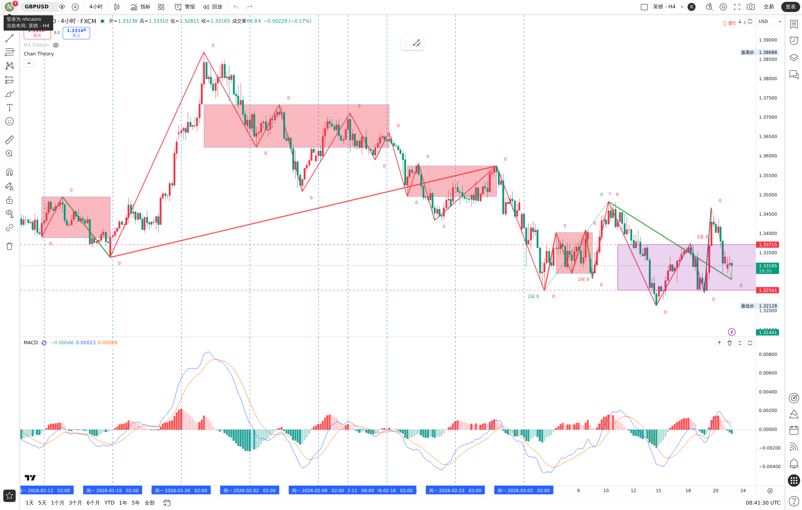
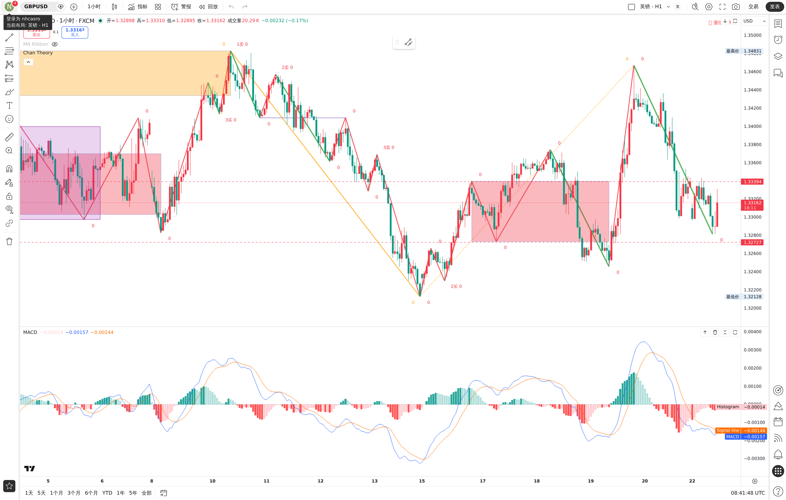
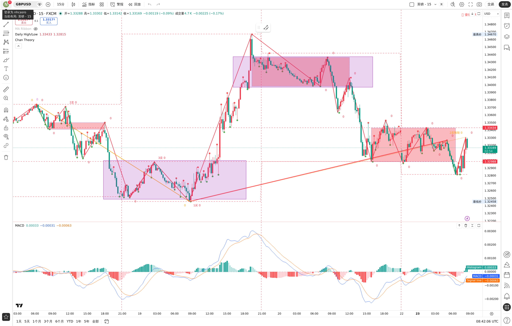
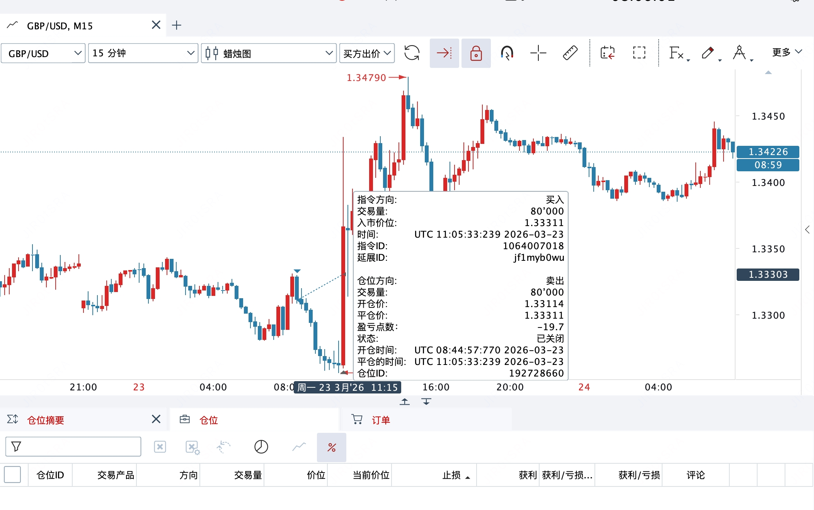

# GBP/USD 多单 · 2026-03-23

## 入场前分析

### 当日分析记录

本笔交易对应的前置分析，已记录在：
- `../memory/trade-2026-03-23.md`
- `../memory/2026-03-23.md`

### 关键图表

### 当时给出的分析结论（后证伪）

- 当时分析判断偏空，倾向观望，不支持做多
- 用户反馈：**昨天虽然分析错了，但依然入场了**
- 用户实际执行：只设置了止损，**未设置止盈**
- 说明：本笔交易不是依据当时正确建议执行，且当时分析结论本身存在错误

---

## 入场

- 日期：2026-03-23
- 方向：多
- 入场价：**1.33311**
- 手数：**80,000 units**（约 0.8 标准手）
- 止损：**已设置，但当前截图未显示具体价格**
- 止盈：**未设置**
- 备注：用户在分析错误的情况下自行入场

---

## 结果

### 结果截图

### 当前已确认结果

- 当前补充截图显示：该多单已**关闭**
- 截图中可见买入价：**1.33311**
- 截图中可见一笔此前空单在 **1.33311** 平仓，亏损 **-19.7 pips**
- 当前价格后来最高已上行至 **1.34790** 附近，说明后续上涨方向成立

### 仍待补充的信息

以下信息当前截图无法完全确认，待用户后续补充：
- 本笔多单最终平仓价
- 本笔多单盈亏金额 / 点数
- 止损具体设置价位
- 实际出场时间

---

## 复盘

- 这笔交易说明：**分析错误 ≠ 市场方向错误判断完全失效，关键还是结构、执行与真实盘面演化**
- 当时机器人给出的方向判断有误，导致止盈参考无效
- 用户仅设止损、不设止盈，虽然保留了向上扩展收益的可能，但也使交易管理缺少预案
- 日后若再次出现“分析与个人判断不一致”的情况，必须在入场前明确：
  - 入场逻辑
  - 止损价
  - 至少一个分批止盈方案
  - 若行情超预期延伸，如何移动保护止损

## 文件完整性检查

### 已记录到位
- 昨日图表截图：已保存
- 昨日前置分析：已记录
- 今日结果截图：已补入本文件
- 用户补充说明（分析错了但仍入场、只设止损未设止盈）：已记录

### 尚未记录完整
- 本笔多单的最终盈亏结果仍不完整，待补充后可再次更新本文件
