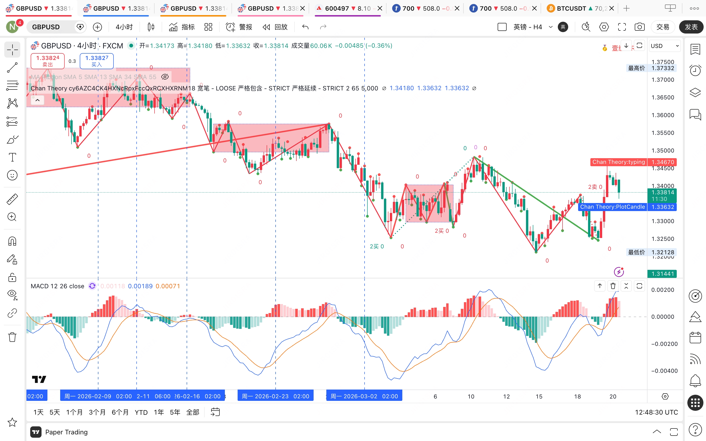
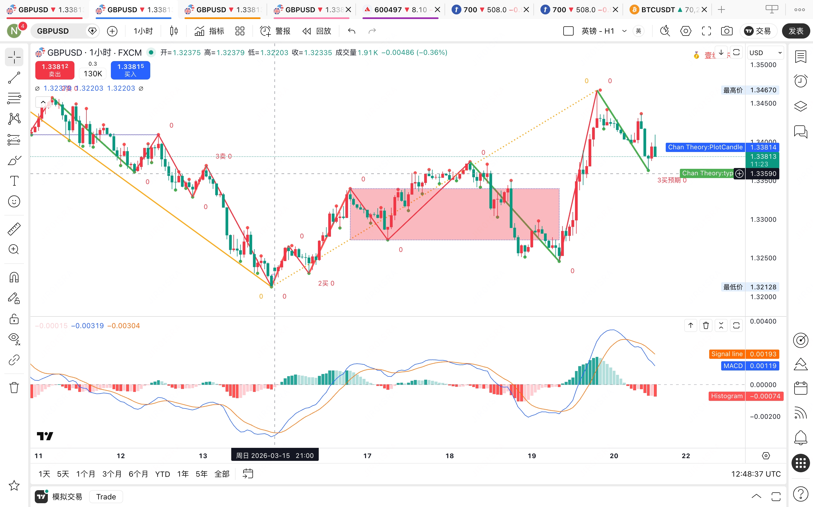

# GBP/USD 空单 · 2026-03-23

## 入场前分析

**防狼术**：4H DIF = -0.00457，0轴下方，空方向通过。

**日线**：下跌趋势延续，当前处于日线中枢震荡上沿，顶背驰信号出现。

**4H图**

4H中枢 ZD≈1.2800，ZG≈1.2960。价格在中枢上沿，MACD顶背驰，面积明显缩减。

**1H图**

1H出现顶分型，3卖结构成立，入场信号确认。

---

## 入场

- 时间：14:30
- 方向：空
- 入场价：1.2945
- 手数：0.3
- 止损：1.2970（25点）
- TP1：1.2900 / TP2：1.2850
- 风险：$75（1.3%，未超限）

---

## 结果

止损出局，出场价 1.2970，亏损 **-$75**。

价格反弹突破止损位，15M顶分型判断偏早，入场时机有误。

---

## 复盘

- 15M顶分型不够标准，应等3根K线完整确认再入场
- 下次等15M MACD死叉后入场，不抢
